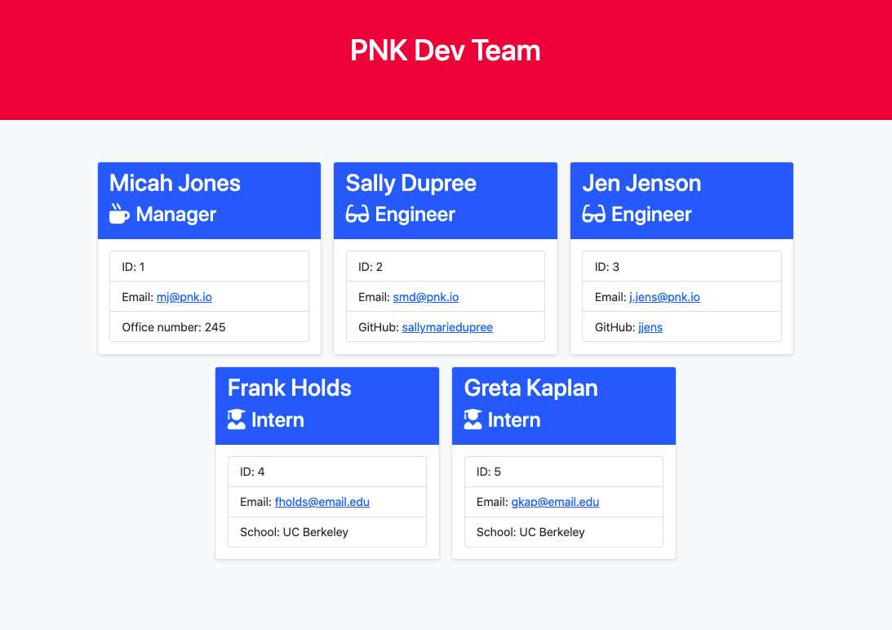

# Team Summary Page Generator

***

## Description

This Node CLI creates an HTML summary page to display a project's team members and their contact information.

Demo

Sample Output

## Table of Contents

[Description](#description) 

[Installation](#installation) 

[Usage](#usage) 

[Tests](#tests) 

[License](#license)

[Questions](#questions)

## Installation

1. Clone this repository. 
1. Install Node.js. 
1. Initialize the project `npm i`.

## Usage

To run the app from the command line type `node index.js` then follow the prompts to input information regarding each team member. The output files are in the `./dist/` directory.

## License

## Tests

Tests may be run with `npm run test [module]`

***

## Questions

Feel free to contact me using the information below!

- GitHub Profile: [@scottrohrig](https://github.com/scottrohrig)

- Email: scott.rohrig@gmail.com

- Project Repository/URL: [team-summary-generator](https://github.com/scottrohrig/team-summary-generator)

- Live Sample Team Summary Page: [team-summary-sample](https://scottrohrig.github.io/team-summary-generator)
